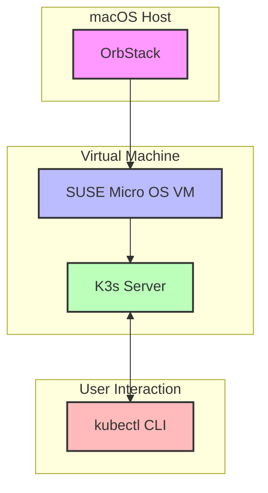

# K3s on SUSE Micro OS with OrbStack

This project provides an automated setup for a k3s cluster using SUSE Micro OS running on OrbStack. The initial implementation focuses on a single-node cluster that can be expanded to a multi-node setup in the future.

## Architecture

## Implementation Plan

### Phase 1: Setup OrbStack and SUSE Micro OS VM

1. **Download Resources Locally**
   - Download SUSE Micro OS image
   - Download k3s binary
   - Download any required dependencies

2. **Create VM in OrbStack**
   - Create a new VM in OrbStack using the SUSE Micro OS image
   - Configure networking for the VM (ensure it has internet access)
   - Start the VM and verify it boots correctly

### Phase 2: Install and Configure K3s on SUSE Micro OS

1. **Prepare SUSE Micro OS**
   - Update the system packages
   - Configure system settings (hostname, timezone, etc.)
   - Install any required dependencies for k3s

2. **Install K3s**
   - Install k3s in server mode on the SUSE Micro OS VM using local resources
   - Configure k3s to start automatically on boot
   - Configure k3s to use local images instead of pulling from remote repositories
   - Verify k3s is running correctly

3. **Configure Access**
   - Set up kubeconfig for remote access
   - Configure network access to allow kubectl commands from the host machine
   - Test connectivity and cluster functionality

### Phase 3: Verification and Testing

1. **Verify Cluster Functionality**
   - Deploy a test application to verify the cluster is working
   - Check cluster status and component health
   - Verify kubectl commands work correctly from the host machine

## Automation Scripts

The following scripts are provided to automate the deployment process:

1. `download_resources.sh` - Downloads all required resources locally
2. `create_vm.sh` - Creates and configures the SUSE Micro OS VM in OrbStack
3. `install_k3s.sh` - Installs and configures k3s on the VM
4. `setup_access.sh` - Configures access to the k3s cluster from the host machine
5. `verify_cluster.sh` - Verifies the cluster is working correctly

## Technical Details

### VM Specifications
- **OS**: SUSE Micro OS (latest version)
- **CPU**: 2 cores (minimum)
- **Memory**: 4GB (minimum)
- **Storage**: 20GB (minimum)
- **Network**: Bridge mode for direct network access

### K3s Configuration
- **Installation Mode**: Server (single node)
- **Version**: Latest stable release
- **Components**: Core Kubernetes components only (no additional services initially)

### Access Configuration
- **kubectl**: Configured on host machine using kubeconfig from the k3s server
- **Network Access**: Direct access to the k3s API server via the VM's IP address

## Future Expansion

While not part of the initial implementation, the following considerations will be important for future expansion:

1. **Adding Worker Nodes**
   - Process for adding additional SUSE Micro OS VMs as worker nodes
   - Configuration for joining the k3s cluster

2. **High Availability**
   - Considerations for converting to a multi-server setup for high availability
   - Database backend options for the HA setup

3. **Persistent Storage**
   - Options for adding persistent storage to the cluster
   - Integration with storage providers